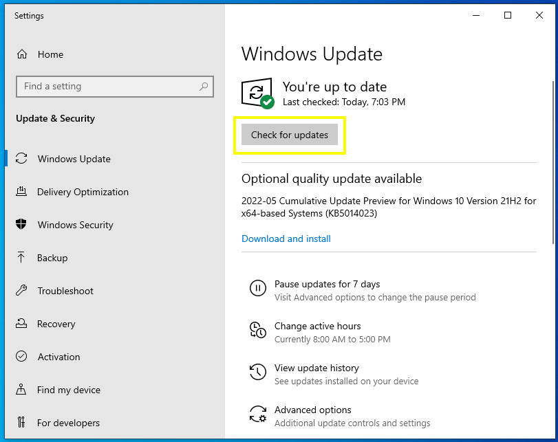
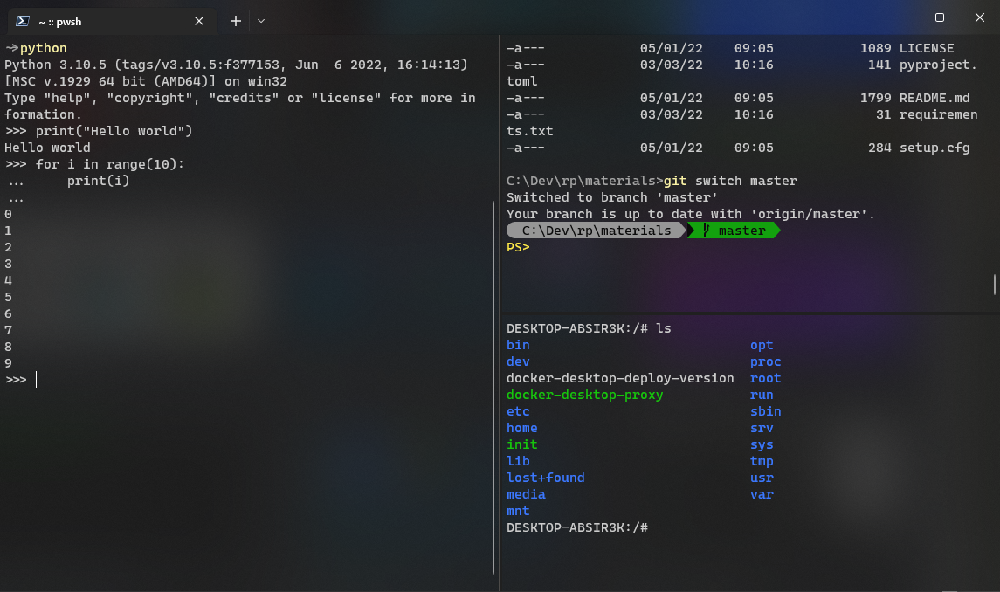
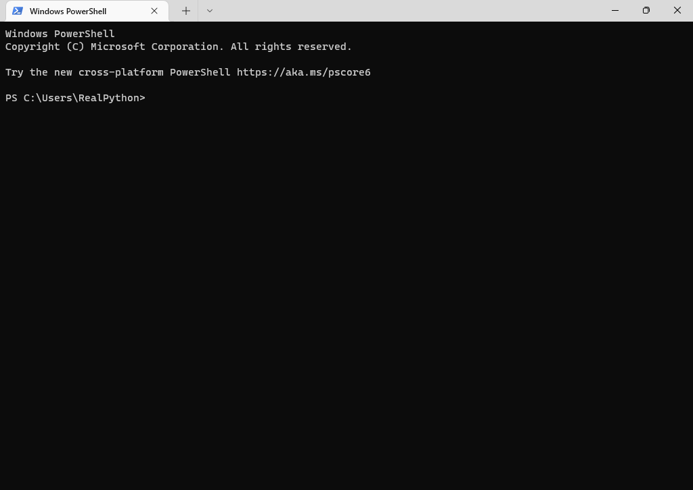
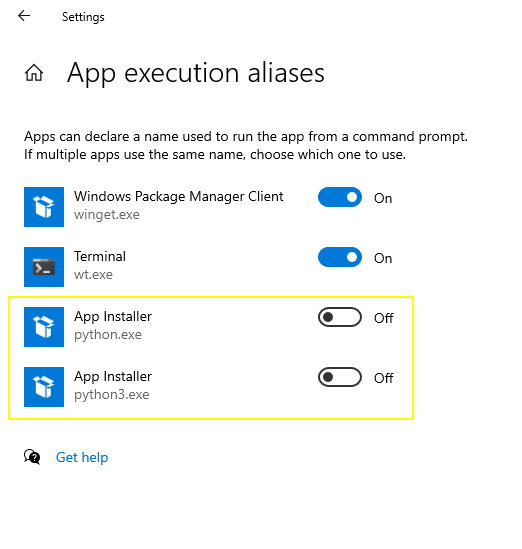

# vim: set comments=s6b\:\ \ \ \*,mb\:\ \ \ \ \ \ -\,ex-3\:\ \ \ \*,\:>,fb\:\*,fb\:-:
# vim: set fo=tcq1rowpn:
# vim: set tw=0:
# MS Windows Setup
This document will include some Windows development configurations. For example, installing a package management tool like scoop or chocolatey, git, cygwin, autojump (zlocation for pwsh), clink, oh-my-posh, pyenv, posh-git, etc... this is a loose guide for setting up and configuring a development environment with preffered tools and code editors installed. It will also go over configuring a custom terminal or shell environment suited to your needs. Let's get started!

## Environment
You could be running a Microsoft Windows System a few different ways:
### 1. Desktop (GUI) Environment
If you are like majority of people, you will most likely be running a Windows Operating System on a personal computer and interacting with it through a graphical user interface (GUI). 

#### Update Windows Installation
In this case, one of the first things you may want to do is **make sure your Windows installation is up to date**. Updating is especially relevant if you want to use [Windows Subsystem for Linux (WSL)](https://en.wikipedia.org/wiki/Windows_Subsystem_for_Linux) and have Windows 10 (or above). It's also a safeguard against the dreaded Windows [auto reboot](https://lolnein.com/2018/01/26/updateandrestart/).

Installing Windows updates can take an hour or two, but it's relatively mindless. So if you're starting here, line up some other tasks while waiting for the updates to complete.

To start the update process, navigate to the **Start Menu** and search for *Windows Update*. Once there, prompt Windows to search for, download and install any updates it can find:

Once all the Updates have finished installing, you'll probably be prompted to reboot the computer. Do this as many times as it asks you to.

You'll probably have to **repeat the update process** a few times. After the first installation update, go back to the update screen in settings and check for updates again and install them if there's more. Once the Windows update process is completed, you're ready to begin the initial setup for the command line environment.

### 2. Command Line Environment
When it comes to the command line interface, there are many options you can choose from, but here we will only mention (arguably) the main three terminal interfaces:
1. **Command Prompt**
2. **PowerShell**
3. ==**Windows Terminal**==

Before we get into choosing a terminal environment, setup and configuring the chosen one, here is a little background on how it works.

If you are familiar with Windows development, then chances are you have used either [**Windows Command Prompt**](https://learn.microsoft.com/en-us/windows-server/administration/windows-commands/windows-commands), [**PowerShell**](https://learn.microsoft.com/en-us/windows-server/administration/windows-commands/powershell), through their own application interfaces. Opening them this way may make you think they are self-contained programs. However, when you run these programs from the Start menu, **two** proccesses are running.
1. One process is the one that performs the commands,
2. The second is a process to send your input and _display_ the output.

The window you see when you open the Command Prompt or PowerShell is the **displaying process**. The core of the application though, is in the background awaiting your input which is sent through the window. So the window acts as a sort of **host** or **interface** to the terminal.

For more information about the differences between command interpreters and interfaces, take a look at the [Introduction to the Shell](https://realpython.com/python-subprocess/#introduction-to-the-shell-and-text-based-programs-with-subprocess) section of that article about the *subprocess* module.

#### Windows Terminal
Windows has recently created a new, open-source , cross-platform command line interface [**Windows Terminal**](https://github.com/microsoft/terminal) to be a universal console host. Check out the [Overview of Windows Terminal](https://learn.microsoft.com/en-us/windows/terminal/) for a more detailed deep-dive guide on its attributes and features. The new Windows Terminal allows you to be able to start the Command Prompt, PowerShell, and any other shell that you might have available each in separate tabs and all at the same time in the same host:

Until the new Windows Terminal was released, many relied on other hosts, also called emulators, to manage their different shell sessoins as tabs or as horizontal and vertial splits/panes. One popular choice was [ConEmu](https://conemu.github.io/), which has more features than the new Windows Terminal. However, Windows Terminal is catching up and has some features than ConEmu does not, such as **unicode emoji** support.

Windows Terminal also has the advantage of have the development effort of the open source community and Microsoft behind it. Windows Terminal is improving and adding features surprisingly quickly. Crucially, for the purposes of setting up an end-to-end development environment, Windows Terminal is a lot easier to set up than ConEmu. Therefore, follow along the next section to install *Windows Terminal* 😎.

#### Installing Windows Terminal
The most reliable method of installing Windows Terminal is to get [Windows Terminal in the Microsoft Store](https://apps.microsoft.com/store/detail/windows-terminal/9N0DX20HK701), accessible from the Start Menu. Installing it from the Microsoft Store ensures that updates come automatically and is hassle free. Other sources seem to [break](https://github.com/mkevenaar/chocolatey-packages/issues/124) relatively often, presumably because Windows Terminal is being developed actively and bery quickly.

Windows Terminal is the only app you'll install without the package manager, which will be later. Hopefully, soon you'll be able to ==manage all your software under **one package manager**.==

Once the Windows Terminal installation form the Microsoft Store is complete, you should be able to find it in the Start Menu under ***Terminal***. If, for some reason, you can't install it form the Microsoft Store, try the [Releases Page](https://github.com/microsoft/terminal/releases/) in the [Github Repository](https://github.com/microsoft/terminal).

When you start Windows Terminal, it should automatically start up with a PowerShell session in a new tab:

After Windows Terminal is installed and working correctly, we'll perform some general Windows configurations.

### Configuring Windows Settings
There are some general Windows settings that you wantt to configure which will help keep your sanity in check. Most of the following configurations are optional, **except the first one**.

#### App Execution Aliases
App execution aliases are a special kind of alias for Windows. For example, if you type `python` into the command line, Windows will automatically ask you if you want to install Microsoft Store version of Python (if you haven't installed Python already).

App execution aliases are a feature to make things easier to **get started**, but they can interfere with other programs. For example, when you [install Pyenv for Windows](https://realpython.com/python-coding-setup-windows/#installing-python-with-pyenv-for-windows) and install other Python versions, the app execution aliases will interfere by not allowing you to access those Python versions.

To disable this, search for the app execution alias control panel from the Start Menu called, *Manage app execution aliases*:

### Windows Terminal Settings
Windows Terminal is designed to be modern, fast, efficient, feature-rich, powerful and productive terminal application for command line users. It is preconfigured to run Command Prompt, PowerShell, WSL, SSH, and Azure Cloud Shell Shell Connector. Windows Terminal is also very configurable and customizable through  its `settings.json` file. There are many customizable settings including Strtup, Interaction, Appearance, Color schemes, Rendering and Actions. Each type of shell is configured and defined by its profile settings and you can create as many profiles as you want. 

#### Completions: CMD
For Command Prompt, you can enable or disable file name completions for a particular invocation of CMD.EXE with the /F:ON or /F:OFF switch. You can enable or disable completion for all invocations of `CMD.EXE` on a machine and/or user logon session by setting either or both of the following `REG_DWORD` values in the registry using `REGEDIT.EXE`:
   * `HKEY_LOCAL_MACHINE\Software\Microsoft\Command Processor\CompletionChar`
   *  `HKEY_LOCAL_MACHINE\Software\Microsoft\Command Processor\PathCompletionChar`
and/or
   * `HKEY_CURRENT_USER\Software\Microsoft\Command Processor\CompletionChar`
   * `HKEY_CURRENT_USER\Software\Microsoft\Command Processor\PathCompletionChar`

with the hex value of a control character to use for a particular function (e.g 0x4 is Ctrl-D and 0x6 is Ctrl-F). The user specific settings take precedence over the machine settings. The command line switches take precedence over the registry settings.

If completion is enabled with the `/F:ON` switch, the two control characters used are `Ctrl`-`D` for directoryname completion and `Ctrl`-`F` for file name completion. To disable a particular completion character in the registry, use the value for space (0x20) as it is not a valid control character.

Completion is invoked when you type either of the two control characters. The completion function takes the path string to the left of the cursor appends a wild card character to it if none is already present and builds up a ist of paths that match. It then displays the first matching path. If no paths match, it just beeps and leaves the display alone. Thereafter, repeated pressing of the same control character will cycle through the list of matching paths. Pressing the Shift key with the control character will move through the list backwards. If you edit the line in any way and press the control character again, the saved list of matching paths is discarded and a new one generated. The same occurs if you switch between file and directory name completion. The only difference between the two control characters is the file completion character matches both file and directory names, while the directory completion character only matches directory names. If file completion is used on any of the built in directory commands (CD, MD, or RD) then directory completion is assumed. 

The completion code deals correctly with file names that contain spaces or other special characters by placing quotes around the matching path. Also, if you back up, then invoke completion from within a line, the text to the right of the cursor at the point copletion was invoked is discarded.

The special characters that require quotes are:
    <space>
    &()[]{}^-;!'+,`~
	

